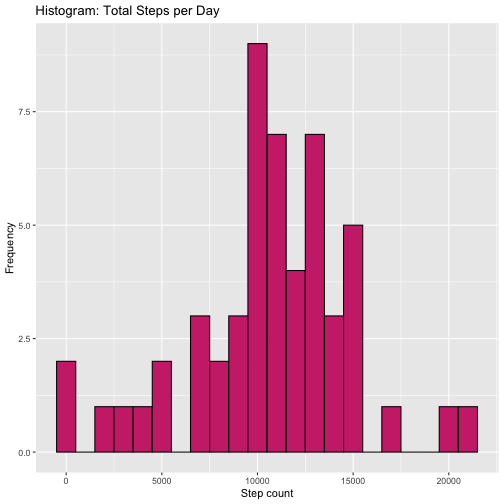
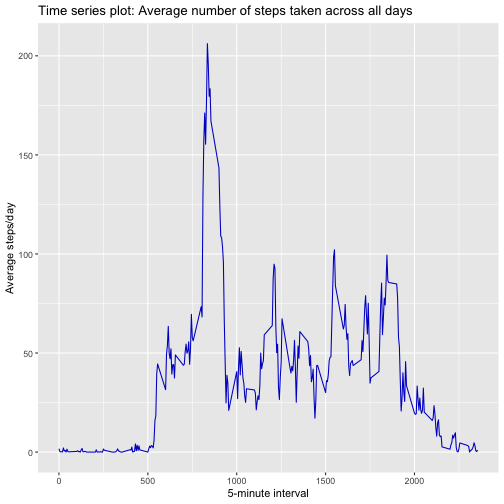
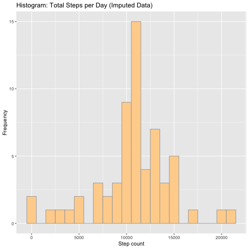
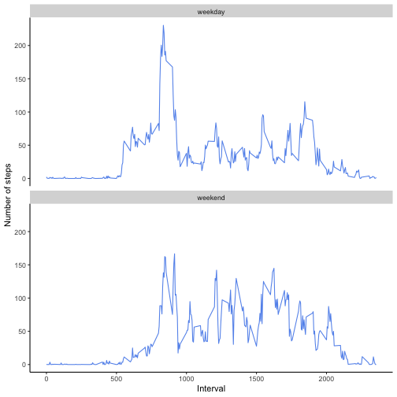

Reproducible Research: Peer Assessment 1
================================================


## Introduction

This assignment makes use of data from a personal activity monitoring device. This device collects data at 5 minute intervals through out the day. The data consists of two months of data from an anonymous individual collected during the months of October and November, 2012 and include the number of steps taken in 5 minute intervals each day.

## Data

The data for this assignment can be downloaded from the course web site:

Dataset: [Activity monitoring data](https://d396qusza40orc.cloudfront.net/repdata%2Fdata%2Factivity.zip)

The variables included in this dataset are:

* **steps**: Number of steps taking in a 5-minute interval (missing values are coded as \color{red}{\verb|NA|}NA)
* **date**: The date on which the measurement was taken in YYYY-MM-DD format
* **interval**: Identifier for the 5-minute interval in which measurement was taken
The dataset is stored in a comma-separated-value (CSV) file and there are a total of 17,568 observations in this dataset.

## Loading libraries


```r
library(knitr)
library(ggplot2)
library(dplyr)
```


## Loading and preprocessing the data


```r
# Extract the .zip file
unzip("activity.zip", exdir = "./activity" )
# Import data
data <- read.csv("activity/activity.csv")
```


```r
# Inspect data
names(data)
```

```
## [1] "steps"    "date"     "interval"
```

```r
sum(is.na(data$steps))
```

```
## [1] 2304
```

```r
sum(is.na(data$date))
```

```
## [1] 0
```

```r
sum(is.na(data$interval))
```

```
## [1] 0
```


```r
# Remove NAs
data <- data[!is.na(data$steps), ]
# View the format of the data objects in R 
str(data)
```

```
## 'data.frame':	15264 obs. of  3 variables:
##  $ steps   : int  0 0 0 0 0 0 0 0 0 0 ...
##  $ date    : Factor w/ 61 levels "2012-10-01","2012-10-02",..: 2 2 2 2 2 2 2 2 2 2 ...
##  $ interval: int  0 5 10 15 20 25 30 35 40 45 ...
```

```r
# Convert data to an R Date class
data$date <- as.Date(data$date, format="%Y-%m-%d")
# View R class of data
class(data$date)
```

```
## [1] "Date"
```

```r
# View first few rows of the data 
head(data)
```

```
##     steps       date interval
## 289     0 2012-10-02        0
## 290     0 2012-10-02        5
## 291     0 2012-10-02       10
## 292     0 2012-10-02       15
## 293     0 2012-10-02       20
## 294     0 2012-10-02       25
```

## What is the mean total number of steps taken per day?
1. Calculate the total number of steps taken per day

```r
# Aggregate the total steps by day
totalsteps_day <- aggregate(data["steps"], by=data["date"], sum)
# View first few rows of the data
head(totalsteps_day)
```

```
##         date steps
## 1 2012-10-02   126
## 2 2012-10-03 11352
## 3 2012-10-04 12116
## 4 2012-10-05 13294
## 5 2012-10-06 15420
## 6 2012-10-07 11015
```

2. Make a histogram of the total number of steps taken each day

```r
# Histogram
ggplot(totalsteps_day, aes(x=steps)) + 
    geom_histogram(color="black", fill="violetred3", binwidth = 1000) +
    labs(title = "Histogram: Total Steps per Day", x = "Step count", y = "Frequency")
```



3. Calculate and report the mean and median of the total number of steps taken per day

```r
# Mean 
meansteps_day <- round(mean(totalsteps_day$steps))
print(c("The mean is",meansteps_day), quote=FALSE)
```

```
## [1] The mean is 10766
```

```r
#Median
medsteps_day <-  round(median(totalsteps_day$steps))
print(c("The median is",medsteps_day), quote=FALSE)
```

```
## [1] The median is 10765
```

## What is the average daily activity pattern?
1. Make a time series plot  (i.e. type = “l”) of the 5-minute interval (x-axis) and the average number of steps taken, averaged across all days (y-axis)


```r
# Group data by 5-minute interval and obtain the average
interval_avg <- data %>% 
    group_by(interval) %>%
    summarize(avg_steps=mean(steps))

# Plot
ggplot(interval_avg, aes(x=interval, y=avg_steps)) +
    geom_line(col="blue3") +
    labs(x="5-minute interval", title="Time series plot: Average number of steps taken across all days", y="Average steps/day")
```



2. Which 5-minute interval, on average across all the days in the dataset, contains the maximum number of steps?


```r
interval_maxstep <- interval_avg$interval[which.max(interval_avg$avg_steps)]
print(paste("The ", interval_maxstep, sep="", "th of the 5-minute interval contains the max no. of steps on average across all the days."), quote = FALSE)
```

```
## [1] The 835th of the 5-minute interval contains the max no. of steps on average across all the days.
```

## Imputing missing values

1. Calculate and report the total number of missing values in the dataset (i.e. the total number of rows with NAs)


```r
rawdata <- read.csv("activity/activity.csv")
nrow(data[is.na(rawdata$steps),])
```

```
## [1] 2304
```

2 & 3. Devise a strategy for filling in all of the missing values in the dataset. The strategy does not need to be sophisticated. For example, you could use the mean/median for that day, or the mean for that 5-minute interval, etc.
Create a new dataset that is equal to the original dataset but with the missing data filled in.


```r
# The mean for the 5-min interval created earlier from the interval_avg data frame would be used.
imputeddata <- rawdata 
for(i in 1:nrow(imputeddata)) {
    if(is.na(imputeddata[i, 'steps'])) {
        # find the index value of steps for when the interval is a match 
        int_match <- which(imputeddata$interval[i] == interval_avg$interval)
        # assign the step value to replace the NA
        imputeddata$steps[i] <- interval_avg$avg_steps[int_match]
    }
}

# View first few rows of the data
head(imputeddata)
```

```
##       steps       date interval
## 1 1.7169811 2012-10-01        0
## 2 0.3396226 2012-10-01        5
## 3 0.1320755 2012-10-01       10
## 4 0.1509434 2012-10-01       15
## 5 0.0754717 2012-10-01       20
## 6 2.0943396 2012-10-01       25
```

4. Make a histogram of the total number of steps taken each day and Calculate and report the mean and median total number of steps taken per day. Do these values differ from the estimates from the first part of the assignment? What is the impact of imputing missing data on the estimates of the total daily number of steps?


```r
# Aggregate the total steps by day in the imputed data set
imputed.totalsteps_day <- aggregate(imputeddata["steps"], by=imputeddata["date"], sum)

# Histogram
ggplot(imputed.totalsteps_day, aes(x=steps)) + 
    geom_histogram(color="darkgrey", fill="burlywood1", binwidth = 1000) +
    labs(title = "Histogram: Total Steps per Day (Imputed Data)", x = "Step count", y = "Frequency")
```



```r
# Mean 
meansteps_day2 <- round(mean(imputed.totalsteps_day$steps))
print(c("The mean is",meansteps_day2), quote=FALSE)
```

```
## [1] The mean is 10766
```

```r
# Median
medsteps_day2 <-  round(median(imputed.totalsteps_day$steps))
print(c("The median is",medsteps_day2), quote=FALSE)
```

```
## [1] The median is 10766
```

```r
# Compare with and without NA's
compar <- NULL
compar <- rbind(compar, data.frame(mean = c(meansteps_day, meansteps_day2), median = c(medsteps_day, medsteps_day2)))
rownames(compar) <- c("with NA's", "without NA's")
print(compar)
```

```
##               mean median
## with NA's    10766  10765
## without NA's 10766  10766
```

```r
# The new mean and median of total number of steps per day are both equal to 10766. The mean is unchanged from before, but the median without NA's increased by 1 step/day.
```

## Are there differences in activity patterns between weekdays and weekends?
1. Create a new factor variable in the dataset with two levels - “weekday” and “weekend” indicating whether a given date is a weekday or weekend day.


```r
# Convert date in the imputed data to an R Date class
imputeddata$date <- as.Date(imputeddata$date, format="%Y-%m-%d")

# Extract “weekday” vs “weekend” 
imputeddata$day <- ifelse(weekdays(imputeddata$date) %in% c("Saturday", "Sunday"), "weekend", "weekday")
imputeddata$day <- as.factor(imputeddata$day)
```

2. Make a panel plot containing a time series plot (i.e. type = “l”) of the 5-minute interval (x-axis) and the average number of steps taken, averaged across all weekday days or weekend days (y-axis). See the README file in the GitHub repository to see an example of what this plot should look like using simulated data.


```r
# Plot
steps_day <- aggregate(steps ~ interval+day, data = imputeddata, mean)
ggplot(steps_day, aes(x=interval, y=steps)) +
    geom_line(col="cornflowerblue") +
    labs(x="Interval", y="Number of steps") +
    facet_wrap(~ day, nrow=2, ncol=1) +
    theme(panel.grid.major = element_blank(), panel.grid.minor = element_blank(), panel.background =
    element_blank(), axis.line = element_line(colour = "black"))
```



